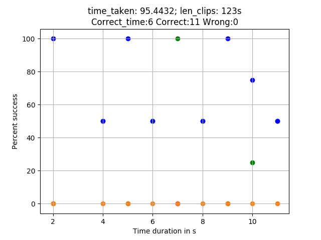

# Audify
- AUDify aims at identifying a song by analyzing its recorded audio segment, which would most likely be distorted due background noise and compressed, owing to the fact that the recording would be done using a tiny in-built microphone on a mobile phone. 
 
- Moreover, the algorithm targets to perform the recognition as fast as possible with a low number of false positives, that is, with the minimum scope of error in detection. 
# Steps Involved
- Sampling
- Quantization
- Discrete Fourier Transform using Fast Fourier Transform technique(Cooley-Tukey algorithm)
- Matching Audio Fingerprints, which are extracted hash tokens from the audio samples, with the fingerprints of the songs present in our database and then the result was computed. 
# Results

